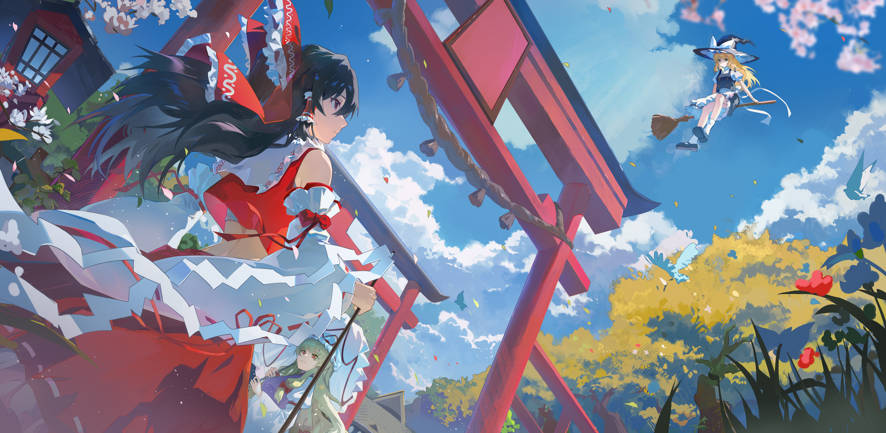

> [!note]
> 首发平台为知乎，本文做为转载不修改（反正是我自己写的，嘻嘻），原文链接： https://zhuanlan.zhihu.com/p/2064106815340668558

好久没看知乎了，今天偶然打开，决定写篇早就想写的文章。

记得五六年前还时常听到所谓“徐福东渡”的传说，说徐福为了不被秦始皇处死，带着一群童男童女逃去了日本，于是便称徐福者为日本的老祖宗了，因而直到如今，每当互联网上传出些中日外交摩擦的风来，就总有人搬出这个故事来，斥责日本是个“不孝之子”，是“目无尊长”。这种论调看似解气，实则暴露了一种根深蒂固的思维惯性——**将文化的优劣，简化为生物学上的“辈分”与“血缘”之争。**

这绝非真正的文化自信，恰恰是精神上“输不起”的代偿。

## 一. 血缘叙事的崩塌

姑且不说“徐福是日本祖先”说法的真伪在历史学上仍然悬而未定，但看这个故事的内在逻辑，便已经荒谬至极。如果因两千年前的一次东渡，便认定日本是“子文明”，那么按照同一套血缘决定论，偏居海岛的日本因人口流动稀少，是否比历经五胡乱华、蒙元更迭的中原大陆保留了更多“上古基因”？**他们是否更有资格反过头来“认祖归宗”甚至“夺回正统”？**

这种反向的推演虽显极端，却精准刺破了“徐福论”的泡沫。文明的伟大，从来不在于“我是你的根”，而在于“我能接纳你的异”。**汉唐盛世从未因胡旋舞传入而焦虑，宋代市井亦未因阿拉伯天文历法而自贬——那种“不设防的开放”才是真自信**。而今天动辄在源头上争孰父孰子的叙事，恰恰像极了自卑者在虚张声势。

## 二. 文化的双标

这种“虚张声势”在现实中演化出了一套极为双标的话语体系。

一方面，我们过于迫不及待的将一些所谓“国产之光”推上神坛，就比如《哪吒2》，作为一个子供向的作品，这个电影的剧情让我感觉即使不算幼稚无聊也不算多么优异，但不乏有人因为别人说《哪吒》无聊而将其“开除中国籍”。姑且不论《哪吒2》的剧本是否匹配其视效的野心，真正值得警惕的并非电影本身，而是舆论场中一种“不许批评”的洁癖——将商业电影的票房高低，直接等同于文化话语权的胜负，去以刷票房的方式营造繁荣的幻象欺骗自己。这种“唯票房/唯特效”的论调，恰恰是陷入了我们曾嗤之以鼻的好莱坞工业拜物教，丢失了以叙事内核撬动共情的能力。

另一方面，我们对于“外来”与“输出”的评判标准全凭立场漂移。当新闻报道某小国跟随中国过春节时，举国欢呼“文化输出”；但当国内城市举办“夏日祭”时，动辄被扣上“狗汉奸”、“文化入侵”的帽子，喊着“敌人达到内部来了”，这种双重标准背后，是将复杂的文化交流简化为零和博弈的危险倾向。此处并非要为夏日祭辩护，而是应当指出：**真正的文化定力，应当是区分“历史创伤场域”与“正常民间交流”的能力。** 如果一刀切地排斥异质，那和当年闭关锁国时的“天朝上国”心态并无二致。

更令人啼笑皆非的是“神话双标”。我们热衷于嘲笑日本正史中将天皇视为“天照大神后裔”的荒诞，却刻意回避中国正史中汉高祖斩白蛇、历代帝王“龙凤托梦、圣人降世”的类似记载。我们一边用五四以来的“祛魅”理性去解构他者，一边又用“祖宗阔过”的古老神话来麻醉自己。**这种“理性对外、迷信对内”的做法，暴露了我们尚未完成对自身历史观的现代化改造**。

一切双标的根源，在于近代百年积贫积弱在文化层面留下的社会性PTSD。当经济总量跃居世界第二后，社会产生了一种急于“文化身份认证”的焦虑。这种焦虑最大的特征就是** “他者导向”**——我们的好坏，必须通过“是否被外国人认可”来证明。

正因如此，早年间一个外国人在抖音喊几句“我爱中国”，便能赚得盆满钵满。这本质上是花钱买“精神抚慰金”。但值得庆幸的是，如今大众对这类“低级红”开始产生抵触，这是觉醒的第一步——我们不再满足于被廉价的夸赞所投喂。

## 三. 矫枉过正

祛魅的过程极易走向矫枉过正的另一端。一部分自诩“独立思考”的人，在对集体无意识的从众感到厌倦后，迅速滑入了“中国人就是蠢”的逆向种族主义，认为外国的月亮总是更圆。**这种盲目的媚外，与盲目的自大是同一枚硬币的两面，它们的反面都是“主体性”的缺失**。无论是“爹味十足”地指责别国，还是“跪态十足”地仰望西方，本质都是将自我价值的评判权拱手让人。

那么，今天我们需要重拾的究竟是什么样的文化自信？

首先，它必须是 **“及物”的**。我们应当有勇气批评国产电影的粗制滥造，也有气度赞美日本匠人对唐构技艺的保留；我们应警惕历史创伤，但不应恐惧夏日祭上的花火与和服，正如我们从不因圣诞节是洋节就否定其在商业社会的活力。

其次，它必须是 **“主体性”的**。一个成熟文明的最大特征，是**坦然承认历史的灰暗与辉煌，坦然接受当下的不足与奋进**。不需要通过编造“徐福东渡”来寻求精神胜利法，也不需要靠外国网红的三两句夸赞来确认自我价值。

---

## 尾声

文化交流如水，不争高下，但求通达。新时代的“闭关锁国”不是关上了海关，而是关上了心门。真正的文化自信，**是拥有 “各美其美”的底气，更拥有“美人之美”的胸襟**。当我们不再执着于做世界的“掌控着”或“依附者”，而是踏踏实实解决好当下的治理难题、创作出反映当代中国人真实喜怒哀乐的作品时，文化影响力自然会像汉唐时期的丝绸与诗歌一样，溢出边界，令人心向往之。

**不卑不亢，最难的不是“不卑”，而是“不亢”。只有“不亢”，才是彻底治愈文化PTSD的良药**。