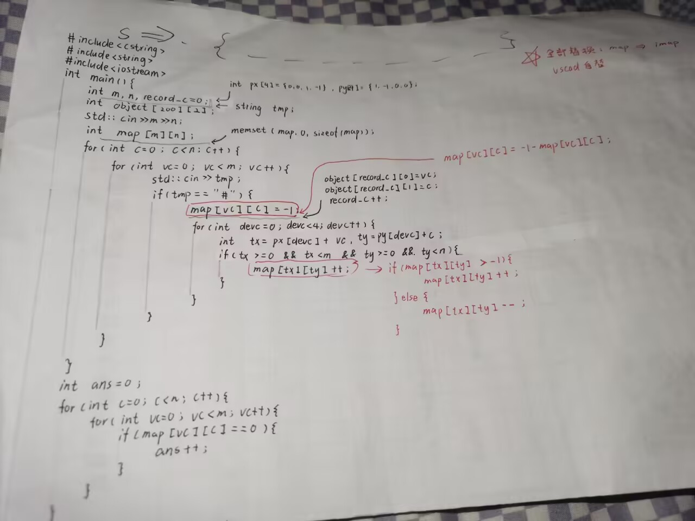

> [!note]
> 本ページはAI技術による翻訳を使用しています。内容は参考までにご覧ください。

# 始める前に

同学がGESP試験を受け、戻ってきて、ある問題でTLE（時間切れ）になったと言いました。彼はさりげなくその問題を私に書き写してくれました。それを見て少し考えが浮かんだので、易言語で書いてみましたが、どんどん乱雑になって諦めました。今週、授業が少し退屈で、他にすることもなかったので、またこの問題を拾い上げました。家で試し、少し変更を加え、無事AC（受理）しました。

元の問題は以下のようなものです：

```
小楊は大きな荒地を持っており、n行m列のグリッドで表すことができる。

小楊はこの荒地を開墾したいと考えている。しかし、荒地のいくつかの位置に雑物がある。雑物がない荒地の区画については、その上下左右の四方向に隣接するマスにいずれも雑物が存在しない場合にのみ、開墾することができる。

小楊は最大1箇所の雑物を除去する位置を選ぶことができる。除去後、その位置は荒地となる。小楊は、最大1箇所の雑物を除去した場合に、最大で何枚の荒地を開墾できるかを知りたい。
```
入力と出力の形式については、Luoguで直接確認するのが良いでしょう: [Luogu B4263](https://www.luogu.com.cn/problem/B4263)。ここにはすべては貼りません。

# コード

私は書きましたが、専門的にアルゴリズムを学んでいるわけではないので、時間計算量や空間計算量についてよく知りませんし、使ったアルゴリズムが何と呼ばれるものかも知りません。ただACしたことだけは知っています。各テストケースは大抵7-25msくらいで通過したようです（下図参照）。


以下は私のコードです。これはコメント付きのバージョンですが、それでも私の不可解な書き方で混乱させる箇所があるかもしれません。理解できなければ、解析部分を読んでください。ほぼ行ごとの解説があります。

```cpp
#include<iostream>
#include<cstring>
int main(){
    int m,n,record_c=0;// 長さ、幅、雑物カウント記録変数
    char tmp;// 実はstringを使いたかった
    int px[4]={0,0,1,-1},py[4]={1,-1,0,0};// 雑物による開墾不能オフセット
    std::cin>>n>>m;// 長さと幅を読み込み（設計上の理由で、逆に読む必要に迫られた）
    int imap[m][n];// マップ配列作成（2次元）
    int object[m*n][2];// 雑物座標記録配列
    memset(imap,0,sizeof(imap));// マップを0で初期化（デフォルト：雑物なし、開墾可能）
    for(int c=0;c<n;c++){// 内容読み込みループ
        for(int vc=0;vc<m;vc++){
            std::cin>>tmp;// tmpに仮読み込み
            if(tmp=='#'){// '#'（雑物）かどうか判定
                imap[vc][c]=-1-imap[vc][c];// 雑物なら負数で記録（叠加：重ね合わせ/累積）
                object[record_c][0]=vc;// 雑物位置を記録、後続作業を減らし時間節約
                object[record_c][1]=c;
                record_c++;// 記録変数を1増やす
                for(int dev_c=0;dev_c<4;dev_c++){// 4回オフセット座標を計算し判定
                    int tx=px[dev_c]+vc,ty=py[dev_c]+c;// オフセット後のX、Y
                    /* 配列操作時の境界外防止のための境界チェック
                    実際、ifが効率に深刻な影響を与えると思うなら、カスタムの境界チェックを検討すること、
                    まず境界を処理し、その後内部を処理する。これにより効率が上がるが、より多くのコードを書くことを意味する。
                    */
                    if((tx>=0)
                    && (tx<m) // これら2行はXのチェック
                    && (ty>=0) // 次の2行はYのチェック
                    && (ty<n)){
                        if(imap[tx][ty]>-1){// 「雑物か否か」をチェック
                            imap[tx][ty]++;// >-1 は雑物でないので、++で影響を記録
                        }else{// <=-1 の場合
                            imap[tx][ty]--;
                        }
                    }
                }
            }
        }
    }

    // 読み込み完了。機械圧縮の力を感じよ！
    // （実際、読みづらいならgotoで解決もできるが、非推奨）

    // デバッグ時に使用したコード、コメント内に保持

    // for(int c=0;c<n;c++){
    //     for(int vc=0;vc<m;vc++){
    //         std::cout<<imap[vc][c]<<" ";
    //     }
    //     std::cout<<std::endl;
    // }

    int ans=0;// 最終出力用に0で初期化したans変数
    // 以下のループはimap配列を読み、"0"の数を数える
    for(int c=0;c<n;c++){
        for(int vc=0;vc<m;vc++){
            // 標準的なループ走査
            if(imap[vc][c]==0){// 現在のセルが0
                ans++;// ansは開墾可能セル数を記録、0は開墾可能、+1記録
            }
        }
    }
    // 現在の状態での開墾可能な区画数は集計完了。
    // 各雑物の走査を開始する。
    int area,best=0;// 雑物除去後に開墾可能になる荒地数を計算する2つの変数
    // areaは一時記録変数、計算毎の開墾可能数を格納
    // bestは最適解、つまり各areaの中での最高値
    for(int c=0;c<record_c;c++){
        area=0;// areaは一時的なので、ループ毎に0で初期化
        // 実際、ここで 'int area;' と書く方が良かったかもしれない。
        for(int vc=0;vc<4;vc++){// 4回オフセット
            int tx=px[vc]+object[c][0],ty=py[vc]+object[c][1];// XYを計算
            if((tx>=0) // 境界チェック、前と同じ
            && (tx<m)
            && (ty>=0)
            && (ty<n)){
                if(imap[tx][ty]==1){// 1なら、現在の雑物の影響のみを受けており、除去すれば開墾可能になる
                    area++;// 開墾可能荒地数 +1
                }
            }
        }
        if(imap[object[c][0]][object[c][1]]==-1){// この雑物が他の雑物の影響範囲内にあるか確認
            area++;// ない場合はさらに1加算
        }
        if(best<area)best=area;
        if(best==5)break;// 最大値は5（自身＋4方向のオフセット）、時間節約のため直接break
    }
    ans+=best;// ansに雑物除去で解放されたスペースを加算
    std::cout<<ans;// 答えを出力
}
```

# 解析

## 1. 問題の分析

問題によると、荒地の区画は`上下左右の四方向に隣接するマスにいずれも雑物が存在しない場合にのみ`開墾できます。このように考えるのは難しそうですが、視点を変えると簡単かもしれません。次の$3×3$の荒地を想定してみましょう。

```
...
.#.
...
```

ここで中心に雑物が出現します。開墾可能な荒地は四方に雑物があってはならないため、この一つの雑物が**影響を及ぼす**のはその上下左右の荒地です。雑物がなくても開墾できない荒地を`!`で表すと以下のようになります。

```
.!.
!#!
.!.
```

つまり、荒地が開墾不能かどうかを判断する思路が、雑物を見つけることに転換しました。以下が、コードの内容です。

## 2. データ読み込みと予備処理

### 「マップ」の準備

問題を解くには、まず問題が提供するデータを受け取らなければなりません。データも満足に受け取れないのに、どう分析できましょうか。そこでまず、最初の2つのデータを受け取るコードを書き、ついでに後のための準備をします。
```cpp
#include<iostream>
#include<cstring>
int main(){
    int m,n,record_c=0;// 長さ、幅、雑物カウント記録変数
    char tmp;// 実はstringを使いたかった
    int px[4]={0,0,1,-1},py[4]={1,-1,0,0};// 雑物による開墾不能オフセット
    std::cin>>n>>m;// 長さと幅を読み込み（設計上の理由で、逆に読む必要に迫られた）
    int imap[m][n];// マップ配列作成（2次元）
    int object[m*n][2];// 雑物座標記録配列
    memset(imap,0,sizeof(imap));// マップを0で初期化（デフォルト：雑物なし、開墾可能）
}
```
ここでは2つのヘッダー、`iostream`と`cstring`を使用しています。1つはほとんど必須で、もう1つは配列の初期化用です。

ここでこう言う人もいるかもしれません：ねえ？ `using namespace std`はどこに行ったの？

実際、熱心に`std::`を追加すれば、この行を書く必要はありません。これには利点があります。アルゴリズム競技ではなかなか反映されませんが、私はより応用重視です（結局最初に学んだのは易言語ですから）、`using`を控えめに使う習慣を常に重視しています。これについては「名前空間汚染」を検索して自行で調べてください。

ここでは整数変数`m`、`n`、`record_c`を定義して、それぞれ：入力nの受け取り、入力mの受け取り、雑物数の保存（ここには不具合があり、mとnが逆に使われており、変更が難しく、最終的にmでnを受け取るような挙動をせざるを得なくなった）；char型変数tmp、後続の'.'と'#'の入力を受け取るための変数。

コード内の`px`と`py`は実際には「オフセット配列」です。実際の使用では、数値nを取り、点$A$に対して、そのX座標+px[n]、Y座標+py[n]を加算することで、オフセットされた点を得ます。このコードのオフセットは、右、左、下、上に対応します。

これらの変数を定義した後、読み込みを開始できます。mとnを読み込む。これら2つの数値は土地全体の大きさを教えてくれ、私たちに「ちょうどいい」配列をマップとして定義するのに役立ちます（私はちょうどいいのがとても好きで、様々なリスクがあっても、結局易言語をたくさん書いてきたので、合理的に見えます）。

`int imap[m][n]`は2次元配列を作成します。imapはマップの意味です（もともとは`map`と書いていましたが、同学がそれは予約語のようだと言ったので、`imap`に変更しました）。これでXとYを使って直接点を操作できるようになります。

`object`とは何ですか？これは雑物の位置情報を保存するために使用します。雑物がたくさんある可能性を考慮すると、$m*n$（m×n）で定義する方が良いと感じました。これも2次元配列ですが、構造体配列のようなものです（実際、毎回`object[n][0]`にXを、`object[n][1]`にYを保存します。構造体にすることもできましたが、面倒だし、配列が好きなので、嘻嘻）。

最終ステップ、`imap`配列を0で初期化します。なぜ0なのかは、次のセクションに移動してください。

### 各位置の情報の定量化

セルは、荒地、雑物、雑物の影響を受ける荒地、または他の雑物の影響範囲内にある雑物である可能性があります。注意：1つの荒地の区画が2つ以上の雑物から同時に影響を受ける可能性があります。

次の例に注意してください。

```
.....
.#.#.
.....
```

この例では、2つの`#`の間の`.`は、たとえ一方の雑物が除去されても、依然としてもう一方の雑物の影響範囲内にあるため、依然として開墾できません。したがって、この除去はこの単一の点に対しては**無効**であると考えます。

この点がいくつの雑物の影響范围内にあるかをどのように記録すればよいでしょうか？私たちは定量化戦略を持っています：0で開墾可能を表し、1で1つの雑物の影響を受けることを表し、2で2つ、最大4までです。

同様に、雑物を配置するセルについても、除去された場合、このセルも開墾できない可能性があるため、記録する必要があります。ここでは-1で雑物を表し、-2で他の1つの雑物の影響範囲内にある雑物を表し、以下同様とします（この設定は後で記録しやすくするためのもので、後で説明します）。

### マップを書く

```cpp
for(int c=0;c<n;c++){// 内容読み込みループ
    for(int vc=0;vc<m;vc++){
        std::cin>>tmp;// tmpに仮読み込み
        if(tmp=='#'){// '#'（雑物）かどうか判定
            imap[vc][c]=-1-imap[vc][c];// 雑物なら負数で記録（叠加：重ね合わせ/累積）
            object[record_c][0]=vc;// 雑物位置を記録、後続作業を減らし時間節約
            object[record_c][1]=c;
            record_c++;// 記録変数を1増やす
            for(int dev_c=0;dev_c<4;dev_c++){// 4回オフセット座標を計算し判定
                int tx=px[dev_c]+vc,ty=py[dev_c]+c;// オフセット後のX、Y
                /* 配列操作時の境界外防止のための境界チェック
                実際、ifが効率に深刻な影響を与えると思うなら、カスタムの境界チェックを検討すること、
                まず境界を処理し、その後内部を処理する。これにより効率が上がるが、より多くのコードを書くことを意味する。
                    */
                if((tx>=0)
                && (tx<m) // これら2行はXのチェック
                && (ty>=0) // 次の2行はYのチェック
                && (ty<n)){
                    if(imap[tx][ty]>-1){// 「雑物か否か」をチェック
                        imap[tx][ty]++;// >-1 は雑物でないので、++で影響を記録
                    }else{// <=-1 の場合
                        imap[tx][ty]--;
                    }
                }
            }
        }
    }
}
```
（変数名が`c`、`dev_c`など奇妙なものでも気にしないでください。`c++`のような文を書きたかっただけです）

文字ごとに読み込む単純なループを使用します。マップを開墾可能で初期化しているので、'.'を読み込んでも大抵は無視して構いません。'#'だけが私たちにとって重要です。それを`imap`と`object`に記録します。

`imap`に記録する操作は次のとおりです：-1 - 現在のセルの内容。元々0だった場合は、今は-1になります。元々1だった場合は、-2になります。前にの[各位置の情報の定量化](#各位置の情報の定量化)セクションを振り返って、一致するか確認できます。

書き終えた後、4回ループし、`px`と`py`配列の4つのオフセットに対応し、影響を計算します：非雑物セルは1を加算し、雑物セルは1を減算します。

オフセットを計算するときは、結果が配列の範囲を超える可能性があることに注意してください。この場合、この存在しない座標に対して操作を行うべきではないので、境界外かどうかをチェックする`if`を追加する必要があります。
## 3. 現在開墾可能な数の統計

ここでの私たちの考え方は次のとおりです：除去できるのは1つだけなので、まず除去なしでどれだけ開墾できるかを計算し、その後、除去することで最も多くの土地を解放できる雑物を見つけます。このため、まず現在開墾可能な数を数える必要があります。

```cpp
int ans=0;// 最終出力用に0で初期化したans変数
// 以下のループはimap配列を読み、"0"の数を数える
for(int c=0;c<n;c++){
    for(int vc=0;vc<m;vc++){
        // 標準的なループ走査
        if(imap[vc][c]==0){// 現在のセルが0
            ans++;// ansは開墾可能セル数を記録、0は開墾可能、+1記録
        }
    }
}
```

明らかに、現在の状態は判断しやすいです。0であれば開墾可能であることを意味します。これは私たちが前に定量化した値です。だから0を見つけるたびに`ans`変数に1を加算します。1回ループした後、`imap`内の0の数が`ans`に保存されます。

## 4. 最適解の検索

ここで必要なのは、最適な除去解を見つけることだけです。ここで最も簡単な方法は`object`を列挙することです。しかし、私の同学は記録された位置を一つずつ'.'に変えてから開墾可能数を分析していたようで、多少非効率的です（多分彼の意図を誤解した？とにかくこの方法は遅い）。実際、オフセットに従って読み取るだけで済みます。

雑物が除去されると、定義によれば、周囲のセルの値はすべて1減少するはずです。その自身の位置は正の数になり、その後1減少します。したがって、自身のセルが-1の場合にのみ、除去により開墾可能になることがわかります。周囲のセルが1の場合にのみ、除去により開墾可能になります。由此 (これにより)、以下のコードが得られます。

```cpp
int area,best=0;// 雑物除去後に開墾可能になる荒地数を計算する2つの変数
for(int c=0;c<record_c;c++){
    area=0;// areaは一時的なので、ループ毎に0で初期化
    for(int vc=0;vc<4;vc++){// 4回オフセット
        int tx=px[vc]+object[c][0],ty=py[vc]+object[c][1];// XYを計算
        if((tx>=0) // 境界チェック、前と同じ
        && (tx<m)
        && (ty>=0)
        && (ty<n)){
            if(imap[tx][ty]==1){// 1なら、現在の雑物の影響のみを受けており、除去すれば開墾可能になる
                area++;// 開墾可能荒地数 +1
            }
        }
    }
    if(imap[object[c][0]][object[c][1]]==-1){// この雑物が他の雑物の影響範囲内にあるか確認
        area++;// ない場合はさらに1加算
    }
    if(best<area)best=area;
    if(best==5)break;// 最大値は5（自身＋4方向のオフセット）、時間節約のため直接break
}
```

"打擂台" (競争) 方式を使用して最適解を選択します。自身とオフセットを合わせても最大5点なので、`best`が5になれば、より良い解はないので`break`できます。これで時間を節約できます。競技では、これをしなくてもACできますが、わずか数行の簡単な最適化も依然として必要です。結局のところ、C++の概念は効性最優先です。

## 5. 出力

最適解は-1と1のみを考慮するため、これらの開墾可能荒地はすべて除去前の状態に対して新たに追加されたものです。単純に`ans`と`best`を加算すれば最終結果が得られます。

```cpp
ans+=best;// ansに雑物除去で解放されたスペースを加算
std::cout<<ans;// 答えを出力
```

----
# 後記

この手書きのコードの原稿を皆さんと共有したいです。細部にいくつかの欠点がありますが、全体的には完成しています。

この問題を解いた後、問題にアプローチする優れた方法があることに気づきました。コードを書いても思い通りに動かないときは、自然言語でアルゴリズムを説明する方法を考えてみてください。この方法は、コードを見つめて頭を抱えるよりも概念的な欠陥を見つけやすくします。アルゴリズムを扱う方は試してみてください。

少し眠く、頭もよく回りません。朦朧としていて不可解なことを書いてしまったかもしれません。まず寝て、起きてから直します。