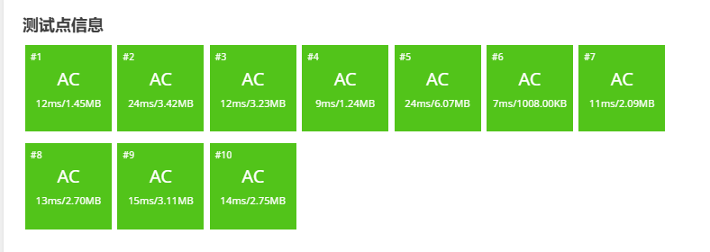

----

# 一.开始之前

同学去考了GESP，回来给我说他有一题TLE了，顺手把题目写给我了，当时看完有点思路，用易语言写了一下，结果越写越乱就放弃了，这周上课有些无聊，闲着也是闲着，干脆又把这题拾起来做了，回家试了试又改了改，顺利AC。

原题是这样的：

```
小杨有一大片荒地，可以表示为一个 n 行 m 列的网格图。

小杨想要开垦这块荒地，但荒地中一些位置存在杂物，对于一块不存在杂物的荒地，该荒地可以开垦当且仅当其上下左右四个方向相邻的格子均不存在杂物。

小杨可以选择至多一个位置，清除该位置的杂物，移除杂物后该位置变为荒地。小杨想知道在清除至多一个位置的杂物的情况下，最多能够开垦多少块荒地。
```
输入输出什么的直接看洛谷吧，我就不一一粘过来了：[洛谷B4263](https://www.luogu.com.cn/problem/B4263)
# 二.代码

虽然我是写出来了，但我毕竟不是专业学算法的，所以我也不知道什么时间复杂度空间复杂度的，更不知道我用的算法叫什么，我只知道我AC了，每次大抵是在7-25ms通过测试点（如下）



下面是我的代码，这个是带注释的版本，但大概也会被我某些地方原因不明的写法迷惑住，如果看不懂可以直接看解析，会有几乎逐行的解读：

```cpp
#include<iostream>
#include<cstring>
int main(){
    int m,n,record_c=0;//长宽与杂物数记录变量
    char tmp;//其实想用string的来着
    int px[4]={0,0,1,-1},py[4]={1,-1,0,0};//杂物的不可开垦偏移
    std::cin>>n>>m;//读入长宽(处于设计原因，被逼无奈反着读了)
    int imap[m][n];//创建地图数组（二维）
    int object[m*n][2];//杂物坐标记录数组
    memset(imap,0,sizeof(imap));//初始化地图为0（即默认无杂物可开垦）
    for(int c=0;c<n;c++){//循环读入内容
        for(int vc=0;vc<m;vc++){
            std::cin>>tmp;//暂时读入tmp
            if(tmp=='#'){//判断是否为#（杂物）
                imap[vc][c]=-1-imap[vc][c];//是杂物则以负数记录叠加
                object[record_c][0]=vc;//记录杂物位置，减少后期工作量，节约时间
                object[record_c][1]=c;
                record_c++;//把记录的变量+1
                for(int dev_c=0;dev_c<4;dev_c++){//四次计算偏移后的坐标并判断
                    int tx=px[dev_c]+vc,ty=py[dev_c]+c;//偏移后的X、Y
                    /*边界判断，防止操作数组时超界
                    实际上，如果你觉得if严重影响执行效率，可以考虑定制化的边界判断，先操作边界再操作内部
                    这样会有更高的效率，但同样意味着你需要写更多的代码
                    */
                    if((tx>=0) 
                    && (tx<m) //这两行是对X的判断
                    && (ty>=0) //下面两行是对Y的判断
                    && (ty<n)){
                        if(imap[tx][ty]>-1){//对于“是否为杂物”进行判断
                            imap[tx][ty]++;//>-1不为杂物，以++方式计录影响
                        }else{//<=-1的情况
                            imap[tx][ty]--;
                        }
                    }
                }
            }
        }
    }

    //读入完成，感受人机缩进的力量吧
    //（实则如果看的不舒服你完全可以用goto解决一下，但是不推荐）

    //下面是调试时使用的代码，在注释里保留了一下

    // for(int c=0;c<n;c++){
    //     for(int vc=0;vc<m;vc++){
    //         std::cout<<imap[vc][c]<<" ";
    //     }
    //     std::cout<<std::endl;
    // }

    int ans=0;//初始化一个为0的ans变量，用于存储最后输出
    //下面的循环，读imap数组，数“0”的个数
    for(int c=0;c<n;c++){
        for(int vc=0;vc<m;vc++){
            //标准的循环遍历
            if(imap[vc][c]==0){//当前格子为0
                ans++;//ans用来记录可开垦格子数，0为可开垦，记录为+1
            }
        }
    }
    //当前状态下可开垦的格子数已经统计完毕了
    //下面要开始遍历每个杂物了
    int area,best=0;//两个变量来算杂物去除后变为可开垦的荒地数
    //area为临时记录变量，存储每次计算的可开垦数
    //best为最优解，也就是每次area中最高的那个
    for(int c=0;c<record_c;c++){
        area=0;//area只是临时变量，每次循环初始化为0
        //事实上，这里写int area;似乎更好
        for(int vc=0;vc<4;vc++){//四次偏移
            int tx=px[vc]+object[c][0],ty=py[vc]+object[c][1];//计算XY
            if((tx>=0) //边界检测，同前
            && (tx<m) 
            && (ty>=0) 
            && (ty<n)){
                if(imap[tx][ty]==1){//如果为1，则证明只被当前杂物影响，移除该杂物就能开垦了
                    area++;//可开垦荒地数+1
                }
            }
        }
        if(imap[object[c][0]][object[c][1]]==-1){//看看这个杂物有没有在别的杂物的影响范围内
            area++;//不在的话再加一
        }
        if(best<area)best=area;
        if(best==5)break;//最大值是五，不可能在大了（自身+四个偏移），直接break节省时间
    }
    ans+=best;//ans加上挪出杂物腾出来的空间
    std::cout<<ans;//输出答案
}
```

# 三.解析

## 1.分析题目

题目说，`上下左右四个方向相邻的格子均不存在杂物`的荒地才可以开垦，用这个思路想似乎是很难的，但换一个思路或许会容易些，我们假设下面这片$3×3$的荒地：

```
...
.#.
...
```

此时中心出现杂物，由于可开垦的荒地上下左右均不能有杂物，因此这一个杂物**影响了**它上下左右的荒地，我们用`!`表示无杂物但不可开垦的荒地：

```
.!.
!#!
.!.
```

也就是说，我们判断荒地是否不可开垦的思路转换为了找杂物，下面的，就是代码内容了。

## 2.数据读入和初步处理

### 准备“地图”

想要解题，肯定得先接住题目给的数据，连数据都接不好还怎么分析，于是先写下接收前两个数据的代码，顺手为后面的事做准备：
```cpp
#include<iostream>
#include<cstring>
int main(){
    int m,n,record_c=0;//长宽与杂物数记录变量
    char tmp;//其实想用string的来着
    int px[4]={0,0,1,-1},py[4]={1,-1,0,0};//杂物的不可开垦偏移
    std::cin>>n>>m;//读入长宽(处于设计原因，被逼无奈反着读了)
    int imap[m][n];//创建地图数组（二维）
    int object[m*n][2];//杂物坐标记录数组
    memset(imap,0,sizeof(imap));//初始化地图为0（即默认无杂物可开垦）
}
```
这里用到了两个头文件，`iostream`和`cstring`，一个几乎是必需品，一个则是初始化数组用的。

这里可能有人会说：诶？`using namespace std`怎么被你吞了？

实际上，只要你勤加`std::`就可以不写这句话，这样做当然是有好处的，虽然在算法竞赛里不容易体现出来，不过我毕竟是个侧重应用的人（毕竟一上来就学的易语言），所以一直注重少用`using`的习惯，有关这个东西，大家可以搜一下“命名空间污染”自行了解。

这里定义了整型变量`m`、`n`、`record_c`分别负责：接受输入n、接受输入m、存储杂物数量（这里是由于写的瑕疵，m和n用反了，结果发现不好改，最后只能做出用m接n这种举动了）；一个char型的变量tmp，也就是接受后面`.`和`#`输入的变量。

代码中的`px`和`py`实际上是“偏移数组”，实际使用中，去一个数字，对于一个点$A$，将其X坐标+px[n]，其Y坐标+py[n]，可以得到一个偏移的点，本代码的偏移对应正的上左下右。

定义玩这些变量后，我们可以开始读入了，读入m和n，这两个数就可以得知正片土地的大小，可以帮助我们定义一个恰到好处的数组作为我们的“地图”（我这个人非常喜欢恰到好处，即使有各种风险，不过毕竟是易语言写多了的，似乎也合理）

`int imap[m][n]`，这是创建了一个二维数组，imap就是地图的意思（本来写的是`map`，但是同学说这貌似是个保留字，就改成`imap`了），这样我们就可以直接用X和Y操作点了。

`object`是什么呢？这里其实是用它存储杂物的位置信息的，考虑到杂物可能有很多，终归感觉还是定义为$m×s$比较好，这也是个二维数组，只不过是一个类似结构体数组的东西（实则每次存都是`object[n][0]`存X、`object[n][1]`存Y，完全可以写成结构体，但我懒，而且我喜欢数组，嘻嘻）

最后一步，给`imap`数组初始化为0，至于为什么是0，请移步下一段。

### 量化每个位置的信息

对于一个格子，它可以是荒地，可以是杂物，可以是被杂物影响的荒地，也有可能是在杂物影响范围内的杂物，需要注意的是：一个荒地有可能同时被两个甚至更多杂物影响。

注意看下面的例子：

```
.....
.#.#.
.....
```

这个例子中，两个`#`中间的`.`，即使在一边的杂物被去除后，仍然处在另一个杂物的影响之内，仍无法开垦，那么我们就认为，这次移除对于这单个点来说是无效的。

那我们该怎么记录这个点在几个杂物的影响范围内呢？我们有一个量化策略，使用0表示可开垦，1表示一个杂物影响，2表示两个，最多可到4。

同样的道理，对于放置杂物的格子，如果拿掉了，这一格也有可能无法开垦，我们同样要记录，这里我们使用-1表示杂物，-2表示被在一个杂物影响范围内的杂物，以此类推（这样设定是为了后面记录方便，这个我们姑且不谈）

### 写地图

```cpp
for(int c=0;c<n;c++){//循环读入内容
    for(int vc=0;vc<m;vc++){
        std::cin>>tmp;//暂时读入tmp
        if(tmp=='#'){//判断是否为#（杂物）
            imap[vc][c]=-1-imap[vc][c];//是杂物则以负数记录叠加
            object[record_c][0]=vc;//记录杂物位置，减少后期工作量，节约时间
            object[record_c][1]=c;
            record_c++;//把记录的变量+1
            for(int dev_c=0;dev_c<4;dev_c++){//四次计算偏移后的坐标并判断
                int tx=px[dev_c]+vc,ty=py[dev_c]+c;//偏移后的X、Y
                /*边界判断，防止操作数组时超界
                实际上，如果你觉得if严重影响执行效率，可以考虑定制化的边界判断，先操作边界再操作内部
                这样会有更高的效率，但同样意味着你需要写更多的代码
                    */
                if((tx>=0) 
                && (tx<m) //这两行是对X的判断
                && (ty>=0) //下面两行是对Y的判断
                && (ty<n)){
                    if(imap[tx][ty]>-1){//对于“是否为杂物”进行判断
                        imap[tx][ty]++;//>-1不为杂物，以++方式计录影响
                    }else{//<=-1的情况
                        imap[tx][ty]--;
                    }
                }
            }
        }
    }
}
```
（请不要在意我诸如`c`、`dev_c`之类的奇怪的变量名，我只是想写出`c++`这样的语句）

我们使用一个很简单的循环逐个字符的读入，由于我们已经将地图初始化为了可开垦，所以督读到`.`大抵可以直接丢弃，只有`#`对我们才是重要的，我们将其记录入`imap`和`object`

记录入`imap`的操作是这样的：-1-当前格内容，如果原本是0，那么现在就是-1，原本是1，现在就是-2，可以回看[量化每个位置的信息](#量化每个位置的信息)那段，看看是不是对上了。

写入完毕后，做四次循环，分别对应`px`和`py`数组的四次偏移，依次计算影响：非杂物块加上一，杂物块减去一。

计算偏移时需要注意一点，偏移后的结果有几率超出数组范围，这个时候就不应该对这个不存在的坐标操作了，所以要加个`if`对于是否超界进行判断。
## 3.当前可开垦的数目统计

我们这里的思路是：既然只能除掉一个，那我们就先算一算不除掉能开垦多少，再找找除掉后能够空出地盘最多的杂物，由此，就需要先统计当前可开垦数目：

```cpp
int ans=0;//初始化一个为0的ans变量，用于存储最后输出
//下面的循环，读imap数组，数“0”的个数
for(int c=0;c<n;c++){
    for(int vc=0;vc<m;vc++){
        //标准的循环遍历
        if(imap[vc][c]==0){//当前格子为0
            ans++;//ans用来记录可开垦格子数，0为可开垦，记录为+1
        }
    }
}
```

显然，当前的状态是好判断的，只要为0，就说明可开垦，这是我们前面量化的数值，那么只要发现0就给`ans`变量加上一就行，循环一次后，`imap`中0的数量就存到`ans`里了。

## 4.最优解查找

这是我们就只差找到移除的最优解了，这里最简单的方法就是枚举`object`了，但我那个同学貌似是把记录的位置依次变成`.`然后分析可开垦数，多少有些低效了（也许我理解错他的意思了？总之这个方法很慢），实际上这个东西只要按照偏移读取就好。

当一个杂物被移走的时候，按照定义，周围的格子数值都应该减1，其所在的位置则是变为正数然后减一，则我们可以知道只要其所在的格子是-1时，移走可开垦；只有其周围格子为1时，一走可开垦，由此，得出以下代码：

```cpp
int area,best=0;//两个变量来算杂物去除后变为可开垦的荒地数
for(int c=0;c<record_c;c++){
    area=0;//area只是临时变量，每次循环初始化为0
    //事实上，这里写int area;似乎更好
    for(int vc=0;vc<4;vc++){//四次偏移
        int tx=px[vc]+object[c][0],ty=py[vc]+object[c][1];//计算XY
        if((tx>=0) //边界检测，同前
        && (tx<m) 
        && (ty>=0) 
        && (ty<n)){
            if(imap[tx][ty]==1){//如果为1，则证明只被当前杂物影响，移除该杂物就能开垦了
                area++;//可开垦荒地数+1
            }
        }
    }
    if(imap[object[c][0]][object[c][1]]==-1){//看看这个杂物有没有在别的杂物的影响范围内
        area++;//不在的话再加一
    }
    if(best<area)best=area;
    if(best==5)break;//最大值是五，不可能在大了（自身+四个偏移），直接break节省时间
}
```

通过所谓“打擂台”的方式选出最优方案，由于自身加上偏移也就最多五个点，因此当`best`为5时就可以`break`了，毕竟已经没用方案能够更优了，这么做可以节省时间，在竞赛中，即使不这么做也能AC，仅仅几行就能做的简单优化也依旧是必须的，毕竟C++的观念就是效率至上。

## 5.输出

由于最优解只看-1和1，这些可开垦荒地都是相对未移除杂物时新增的，直接将`ans`和`best`简单的相加即可的到最后结果

```cpp
ans+=best;//ans加上挪出杂物腾出来的空间
std::cout<<ans;//输出答案
```

----
# 四.后记

还是忍不住想给大家分享一下这份我手写的原稿代码，虽然有一些细节上的瑕疵，但总体还是完整的

经过这次的解题，我意识到有一种写题方法是极优的，当你写完了代码运行起来却事与愿违时，不妨想想如何用自然语言来描述你的算法，这样的方式相比对着代码抓头发等容易发现思想上的纰漏，各位搞算法的可以尝试一下。

有些困了，脑子也不好用了，可能迷迷糊糊的写了一些原因不明的话，先睡了，等睡醒再改改吧