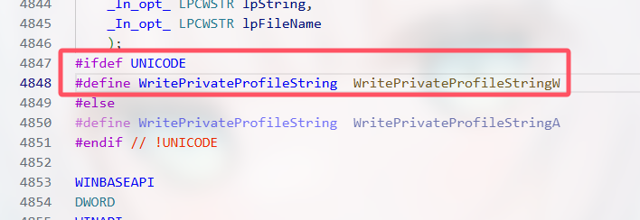

# VScode插件报错，g++却完美编译？API调用错因分析

前一段时间写了个[小软件](https://github.com/xiaoditx/BeepMusic)，想给它加个读写配置项功能，刚学几天C++的我上网查了半天资料，找到两个Windows的API分别是读ini的`GetPrivateProfileString`和写ini的`WritePrivateProfileString`，根据网上的教程，我写出了下面这三行：

```cpp
    LPTSTR lpPath = new char[MAX_PATH];
    strcpy(lpPath, ".\\config.ini");
    ::WritePrivateProfileString("config", "t", "120", lpPath);
```

刚刚写完，VScode安的插件瞬间爆红，然后给出了这样的报错：

但是我确定我是完全按照教程走的，所以到底是哪里的问题呢？

于是我尝试编译，结果非常惊人，g++没有任何报错的编译成功并且在当前目录新建了`config.ini`并写入了指定内容


这有些奇怪，还是查查官方文档吧

上MSDN，查`WritePrivatePeofileString`，却并没有查到，只查到了`WritePrivatePeofileStringA`和`WritePrivatePeofileStringW`（末尾都多了个字母）这两个函数


没办法了，只好点进一个看看，我选择了`WritePrivatePeofileStringA`，诶，这个参数的类型好像不对，跟着教程写的是`LPTSTR`，但这里面写的是`LPCSTR`

向下划，我在`例子`板块的下方看到了一串提示

> winbase.h 标头将 WritePrivateProfileString 定义为一个别名，该别名根据 UNICODE 预处理器常量的定义自动选择此函数的 ANSI 或 Unicode 版本。 将中性编码别名与不中性编码的代码混合使用可能会导致编译或运行时错误不匹配。 有关详细信息，请参阅函数原型的 约定。

也就是说，`WritePrivatePeofileString`不是这个API的原名，它只是根据条件进行选择的

回到VScode，按住Ctrl并单击`WritePrivatePeofileString`，看到了`Windows.h`中的内容：

```cpp
#ifdef UNICODE
#define WritePrivatePeofileString WritePrivatePeofileStringW
#else
#define WritePrivatePeofileString WritePrivatePeofileStringA
#endif
```

VScode显示，上方是亮着的，证明VScode的环境下有UNICODE这个宏




这下破案了，由于VScode有UNICODE宏而g++没有，所以插件检查时是按照`WritePrivatePeofileStringW`检查的，此时插件认为需要使用unicode，路径需要使用`wchar_t`也就是宽字符存储，g++编译时，按照`WritePrivatePeofileStringA`，此时g++认为要用ANSI，路径使用`char`也就是普通字符存储，于是我们使用的`char`的代码在g++下正常而没有通过VScode的插件检查

因此，我们的书写是正确的，但是由于VScode的环境与g++不同，被插件当作了错误，此时我们应当指明我们要使用`WritePrivatePeofileStringA`函数：

```cpp
    char* lpPath = new char[MAX_PATH];
    strcpy(lpPath, ".\\config.ini");
    ::WritePrivateProfileStringA("LiMing", "Sex", "Man", lpPath); 
    delete[] lpPath;
```

到这里就结束了，烦人的提醒终于消失不见了

-----

另附：LPxxxSTR数据类型的具体含义

1.  **核心基础类型:**
    *   `CHAR`: 表示一个 **ANSI** (8-bit) 字符 (`char`)。
    *   `WCHAR`: 表示一个 **宽字符** (Unicode, 通常是 16-bit UTF-16) (`wchar_t`)。
    *   `TCHAR`: **自适应字符类型**。根据项目设置（是否定义了 `_UNICODE` 宏）编译为 `CHAR` 或 `WCHAR`。用于编写既可编译为 ANSI 也可编译为 Unicode 的代码。

2.  **字符串指针类型:**
    *   `LPSTR`: **Long Pointer to STRing**。指向以 NULL 结尾的 **ANSI** 字符串 (`CHAR*`)。
        *   `typedef CHAR* LPSTR;`
    *   `LPWSTR`: **Long Pointer to Wide STRing**。指向以 NULL 结尾的 **Unicode** (UTF-16) 字符串 (`WCHAR*`)。
        *   `typedef WCHAR* LPWSTR;`
    *   `LPTSTR`: **Long Pointer to TCHAR STRing**。指向以 NULL 结尾的 **自适应字符** (`TCHAR*`) 字符串。根据 `_UNICODE` 宏定义，编译时等同于 `LPSTR` (ANSI) 或 `LPWSTR` (Unicode)。
        *   `typedef TCHAR* LPTSTR;`

3.  **常量字符串指针类型:**
    *   `LPCSTR`: **Long Pointer to Constant STRing**。指向以 NULL 结尾的 **常量 ANSI** 字符串 (`const CHAR*`)。
        *   `typedef const CHAR* LPCSTR;`
    *   `LPCWSTR`: **Long Pointer to Constant Wide STRing**。指向以 NULL 结尾的 **常量 Unicode** (UTF-16) 字符串 (`const WCHAR*`)。
        *   `typedef const WCHAR* LPCWSTR;`
    *   `LPCTSTR`: **Long Pointer to Constant TCHAR STRing**。指向以 NULL 结尾的 **常量自适应字符** (`const TCHAR*`) 字符串。根据 `_UNICODE` 宏定义，编译时等同于 `LPCSTR` (ANSI) 或 `LPCWSTR` (Unicode)。
        *   `typedef const TCHAR* LPCTSTR;`

**关键区别总结表：**

| 类型      | 字符宽度      | 常量性 (const) | 基础类型等价 (ANSI Build) | 基础类型等价 (Unicode Build) | 描述                                         |
| :-------- | :------------ | :------------- | :------------------------ | :--------------------------- | :------------------------------------------- |
| **LPSTR** | ANSI (8-bit)  | 非 const       | `char*`                   | `char*`                      | 指向 ANSI 字符串的指针                       |
| **LPCSTR**| ANSI (8-bit)  | **const**      | `const char*`             | `const char*`                | 指向 **只读** ANSI 字符串的指针              |
| **LPWSTR**| Unicode (16-bit) | 非 const     | `wchar_t*`                | `wchar_t*`                   | 指向 Unicode (UTF-16) 字符串的指针           |
| **LPCWSTR**| Unicode (16-bit)| **const**    | `const wchar_t*`          | `const wchar_t*`             | 指向 **只读** Unicode (UTF-16) 字符串的指针  |
| **LPTSTR**| **自适应**    | 非 const       | `char*` (LPSTR)           | `wchar_t*` (LPWSTR)          | 指向自适应字符串的指针 (TCHAR*)              |
| **LPCTSTR**| **自适应**   | **const**      | `const char*` (LPCSTR)    | `const wchar_t*` (LPCWSTR)   | 指向 **只读** 自适应字符串的指针 (const TCHAR*) |

**重要说明:**

1.  **`LP` 前缀:** "Long Pointer" 是一个历史遗留物，在现代 32/64 位系统中，所有指针都是 "long"，可以简单地把 `LP` 理解为 "Pointer to"。
2.  **`C` 后缀:** 表示 `const`，即指针指向的内容是只读的，不能通过这个指针修改字符串内容。
3.  **`T` 中缀:** 表示类型是 `TCHAR`，它会根据项目字符集设置自适应。这是为了编写同时支持 ANSI 和 Unicode 构建的代码。
4.  **`W` 后缀:** 表示 "Wide"，即 Unicode (UTF-16)。
5.  **`STR` 后缀:** 表示 "String" (以 NULL 结尾的字符数组)。
6.  **现代 Windows 开发实践:**
    *   **强烈推荐始终使用 Unicode 构建项目** (在 Visual Studio 项目属性中设置 "字符集" 为 "使用 Unicode 字符集")。这定义了 `_UNICODE` 宏。
    *   在 Unicode 构建下：
        *   `TCHAR` = `WCHAR`
        *   `LPTSTR` = `LPWSTR`
        *   `LPCTSTR` = `LPCWSTR`
    *   直接使用 `LPCWSTR`/`LPWSTR` 或 `LPCWSTR`/`LPWSTR` 的别名 `std::wstring` (C++) 通常更清晰，避免 `TCHAR` 系列的歧义，除非你明确需要维护同时支持 ANSI/Unicode 的旧代码库。
    *   ANSI (`LPSTR`/`LPCSTR`) API 函数在内部通常只是将字符串转换为 Unicode 然后调用对应的 Unicode 版本函数，存在性能开销和潜在的字符集转换问题。优先使用显式的 Unicode (W) 版本 API。
7.  **兼容性:** `TCHAR` 系列主要是为了兼容旧的 Windows 9x 系统（主要使用 ANSI）和现代 NT 系统（原生 Unicode）。现代开发（Windows 2000 及以后）应首选 Unicode。

**简单记忆:**

*   看 `W` -> Unicode。
*   看 `C` -> `const` (不能修改字符串内容)。
*   看 `T` -> 自适应，根据项目设置变 ANSI 或 Unicode。
*   没有 `W` 也没有 `T` -> ANSI。
*   没有 `C` -> 字符串内容可修改 (非常量)。
*   有 `C` -> 字符串内容只读 (常量)。

**使用建议:**

*   新项目：**始终开启 Unicode 构建 (`_UNICODE` defined)**。优先使用 `LPCWSTR` (输入参数) 和 `LPWSTR` (输出参数)，或者在 C++ 中使用 `const wchar_t*` 和 `std::wstring`。
*   维护旧项目/需要 ANSI 兼容：使用 `LPCTSTR` (输入) 和 `LPTSTR` (输出) 或对应的 `TCHAR` 基础类型，并确保正确处理 `_UNICODE` 宏定义。
*   与 Windows API 交互时，注意 API 函数通常有 A (ANSI) 和 W (Wide/Unicode) 两个版本（如 `MessageBoxA` 和 `MessageBoxW`）。使用通用宏 `MessageBox` 会根据 `_UNICODE` 自动选择正确的版本。传递的字符串指针类型也必须与之匹配（`LPCSTR` 对应 A 版本，`LPCWSTR` 对应 W 版本，`LPCTSTR` 对应通用宏）。