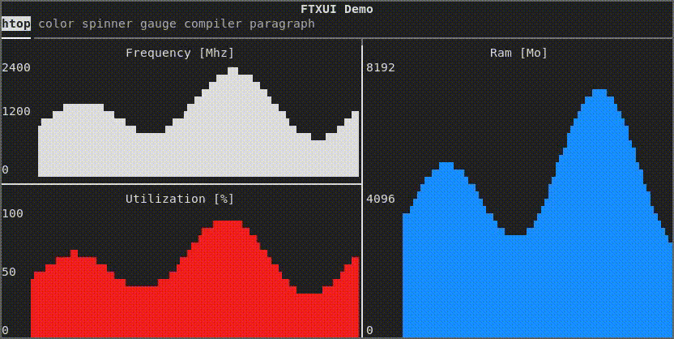

翻译版本：2025/8/27

## 简介



**FTXUI** 是一个简单、跨平台的 C++ 库，用于构建终端用户界面！

## 特性

- 函数式风格。灵感来源于
  [1](https://hackernoon.com/building-reactive-terminal-interfaces-in-c-d649ce34e649?gi=d9fb9ce35901)
  和 [React](https://reactjs.org/)
- 无依赖
- **跨平台**
- 简洁优雅的语法（个人观点）
- 键盘和鼠标导航
- 支持 [UTF8](https://en.wikipedia.org/wiki/UTF-8) 和 [全角字符](https://en.wikipedia.org/wiki/Halfwidth_and_fullwidth_forms) (→ 测试)
- 支持动画效果。[演示 1](https://arthursonzogni.github.io/FTXUI/examples/?file=component/menu_underline_animated_gallery), [演示 2](https://arthursonzogni.github.io/FTXUI/examples/?file=component/button_style)
- 支持绘图功能。[演示](https://arthursonzogni.github.io/FTXUI/examples/?file=component/canvas_animated)
- 通过[示例](#documentation)和[教程](#documentation)学习
- 支持多种构建系统和软件包
- 良好的工程实践：文档、测试、模糊测试、性能测试、自动化 CI、自动化打包等

## 示例

```cpp
#include <ftxui/dom/elements.hpp>
#include <ftxui/screen/screen.hpp>
#include <iostream>

int main() {
  using namespace ftxui;

  // 创建包含三个文本元素的简单文档
  Element document = hbox({
    text("左侧")   | border,
    text("中间") | border | flex,
    text("右侧")  | border,
  });

  // 创建宽度全屏、高度自适应文档的屏幕
  auto screen = Screen::Create(
    Dimension::Full(),       // 宽度
    Dimension::Fit(document) // 高度
  );

  // 将文档渲染到屏幕上
  Render(screen, document);

  // 将屏幕输出到控制台
  screen.Print();
}
```

预期输出：

```
┌────┐┌────────────────────────────────────┐┌─────┐
│左侧││中间                                ││右侧 │
└────┘└────────────────────────────────────┘└─────┘
```

## 支持的平台

- Linux
- MacOS
- Windows
- WebAssembly

<div class="section_buttons">

</div>